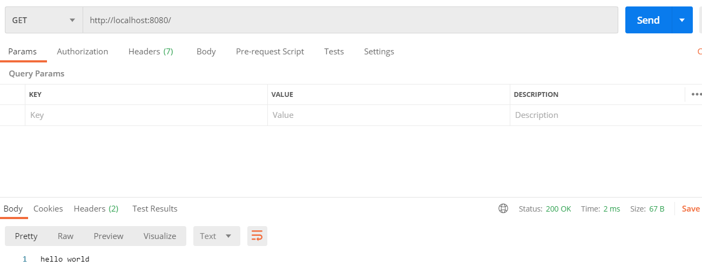
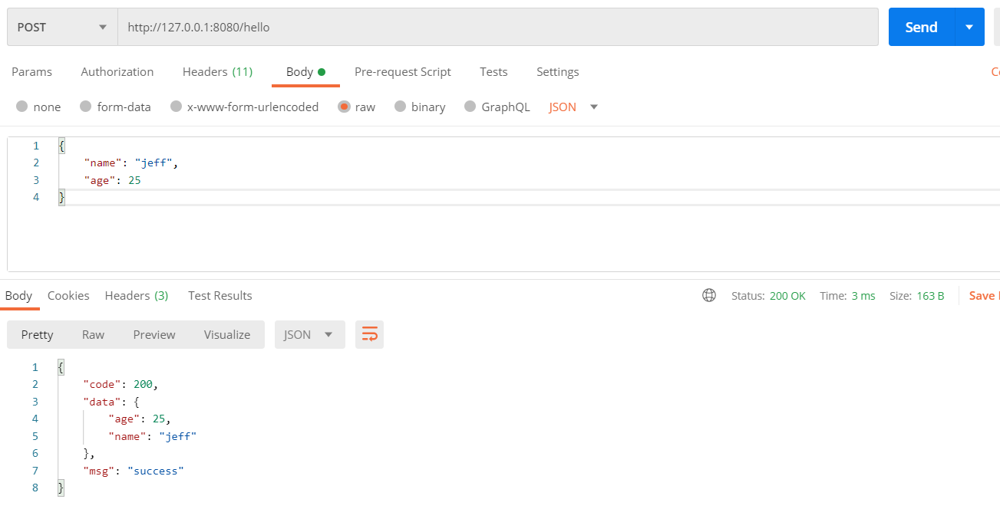

# GET method

# POST method

# Dependency
 - [cinatra](https://github.com/qicosmos/cinatra) net framework and it has following dependencies:
     
     (1) C++17 compiler (gcc 7.2, clang 4.0, Visual Studio 2017 update 15.5, or later versions)
     
     (2) Boost.Asio (or standalone Asio)
     
     (3) Boost.System
 - [json](https://github.com/nlohmann/json)
